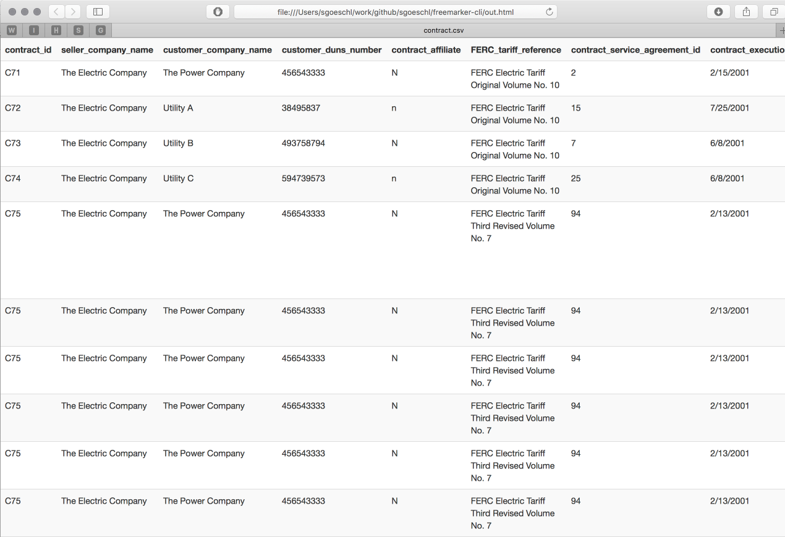
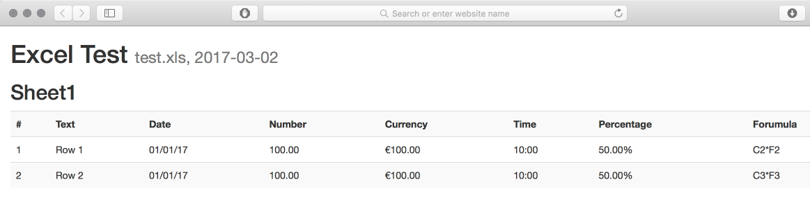
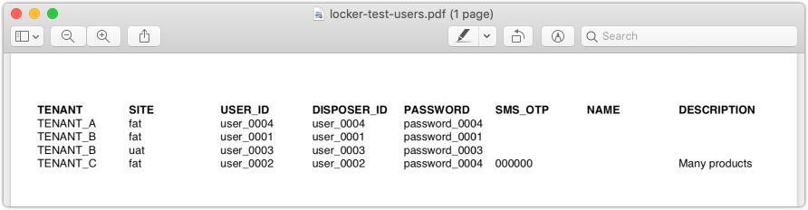
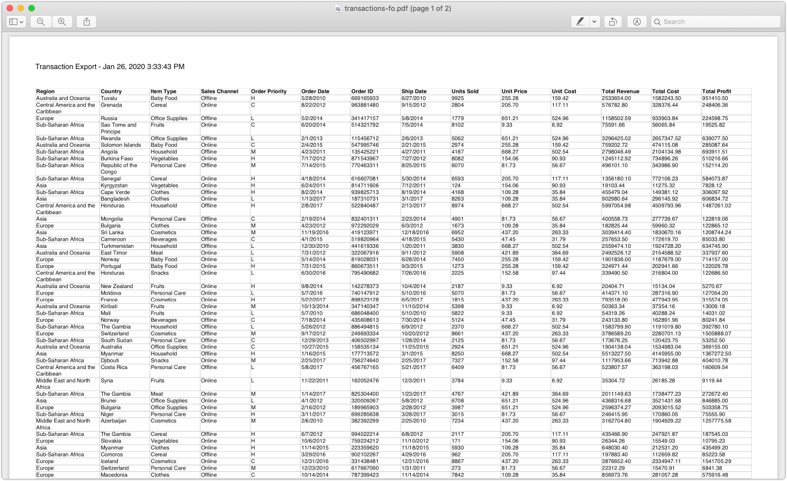

# Apache FreeMarker Generator CLI

# 1. Is This Project For You?

You somehow found this GitHub project and wonder if it solves a problem you might have?!

* You need to transform some structured text document (CSV, HTML, JSON, XML, YAML, Java Property files, access logs) into CSV, HTML, Markdown or Confluence markup?
* You need to convert an Excel document into CSV, HTML or Markdown?
* You need to create a nice-looking PDF from some boring-looking CSV or JSON content ?

The goal of `freemarker-cli` is to automate repeated transformation tasks 

* Which are too boring to be done manually 
* Which happen not often enough to write a dedicated script or program

# 2. Once Upon A Time

In December 2015 I needed a little bit of test data management for a customer project - to make a long story short (after writing a few more Groovy scripts) it boiled down to transforming one or more JSON files to something human readable.

What are the options?

* The cool kids say 'Node.js' - but they always say 'Node.js' 
* Some fancy Groovy scripts using Groovy's markup builder - but the syntax looks a bit odd
* Using 'JsonPath' and 'Velocity' to reuse good & old stuff

So I went with 'Apache Groovy', 'JsonPath' and 'Apache Velocity'

* Playing with Groovy over the public holidays
* Groovy has a built-in package manager which makes distribution a breeze
* Providing samples to transform JSON to Markdown

Using Velocity actually created some minor issues so I migrated to [Apache FreeMarker](https://freemarker.apache.org) during Christmas 2016

* Velocity 1.7 was released 2010 and only recently there was a new release
* I was painful to get Velocity Tools working
* Velocity XML processing support is also painful
* Spring 4.3 deprecated Velocity support which could affect me in the long run
* FreeMarker has no additional dependencies and things are just working :-)

While I love Apache Velocity (Apache Turbine anyone?) I decided to give FreeMarker a chance and migrated my [velocity-cli](https://github.com/sgoeschl/velocity-cli) to FreeMarker.

Some years later the not-so-small-any-longer-and-not-having-tests Groovy script was still growing so I decided 

* To ditch Groovy and migrate to plain JDK 8
* Write unit tests since I had no more excuses
* To ditch Commons CLI and migrate to [Picocli](https://picocli.info)

# 3. Design Goals

* Create a proper command-line tool which has Unix look & feel
* Handle arbitrary large input and output data
* Support multiple source files/directories for a single transformation
* Support transformation of Property files using plain-vanilla JDK
* Support transformation of CSV files using [Apache Commons CSV](https://commons.apache.org/proper/commons-csv/)
* Support transformation of JSON using [Jayway's JSONPath](https://github.com/jayway/JsonPath) and [GSON](https://github.com/google/gson)
* Support transformation of Excel using [Apache POI](https://poi.apache.org)
* Support transformation of YAML using [SnakeYAML](https://bitbucket.org/asomov/snakeyaml/wiki/Home)
* Support transformation of HTML using [JSoup](https://jsoup.org)
* Support transformation of structured logfiles using [Grok](https://github.com/thekrakken/java-grok)
* XML & XPath is supported by FreeMarker [out-of-the-box](http://freemarker.org/docs/xgui.html)
* Support for reading a data source content from STDIN to integrate with command line tools
* Support execution of arbitrary commands using [Apache Commons Exec](https://commons.apache.org/proper/commons-exec/)
* Add some commonly useful information such as `System Properties`, `Enviroment Variables`
* Support embedding the code in existing applications

# 4. Installation

Download the latest release from [GitHub](https://github.com/sgoeschl/freemarker-cli/releases), e.g. [freemarker-cli-2.0.0-BETA-5-app.tar.gz](https://github.com/sgoeschl/freemarker-cli/releases/download/v2.0.0-BETA-4/freemarker-cli-2.0.0-BETA-5-app.tar.gz) and unpack it into of a directory of your choice, e.g `/Application/Java/freemarker-cli`

It is recommended 

* To add `bin/freemarker-cli` or `bin/freemarker-cli.bat` to your executable path
* To create a `~/.freemarker-cli` directory to store your custom FTL templates

You can test the installation by executing

```text
> ./bin/freemarker-cli -t templates/info.ftl
FreeMarker CLI Information
------------------------------------------------------------------------------
FreeMarker version     : 2.3.30
Template name          : info.ftl
Language               : en
Locale                 : en_US
Timestamp              : Jun 18, 2020 10:55:04 AM
Output encoding        : UTF-8
Output format          : plainText

FreeMarker CLI Template Directories
------------------------------------------------------------------------------
[#1] /Users/sgoeschl/work/github/apache/freemarker-generator/freemarker-generator-cli/target/appassembler
[#2] /Users/sgoeschl/.freemarker-cli

FreeMarker CLI Tools
------------------------------------------------------------------------------
- CSVTool              : Process CSV files using Apache Commons CSV (see https://commons.apache.org/proper/commons-csv/)
- DataFrameTool        : Bridge to nRo/DataFrame (see https://github.com/nRo/DataFrame)
- ExcelTool            : Process Excels files (XLS, XLSX) using Apache POI (see https://poi.apache.org)
- ExecTool             : Execute command line tools using Apache Commons Exec (see https://commons.apache.org/proper/commons-exec/)
- FreeMarkerTool       : Expose useful Apache FreeMarker classes
- GrokTool             : Process text files using Grok expressions (see https://github.com/thekrakken/java-grok)
- GsonTool             : Process JSON files using GSON (see https://github.com/google/gson)
- JsonPathTool         : Process JSON files using Java JSON Path (see https://github.com/json-path/JsonPath)
- JsoupTool            : Process  HTML files using Jsoup (see https://jsoup.org)
- PropertiesTool       : Process JDK properties files
- SystemTool           : Expose System-related utility methods
- UUIDTool             : Create UUIDs
- XmlTool              : Process XML files using Apache FreeMarker (see https://freemarker.apache.org/docs/xgui.html)
- YamlTool             : Process YAML files using SnakeYAML(see https://bitbucket.org/asomov/snakeyaml/wiki/Home)

FreeMarker CLI Data Model
---------------------------------------------------------------------------
- CSVTool
- DataFrameTool
- DataSources
- ExcelTool
- ExecTool
- FreeMarkerTool
- GrokTool
- GsonTool
- JsonPathTool
- JsoupTool
- PropertiesTool
- SystemTool
- UUIDTool
- XmlTool
- YamlTool
```

There a many examples (see below) available you can execute - run `./run-examples.sh` and have a look at the generated output

```text
./run-examples.sh 
templates/info.ftl
examples/templates/demo.ftl
examples/templates/csv/html/transform.ftl
examples/templates/csv/md/transform.ftl
examples/templates/csv/shell/curl.ftl
examples/templates/csv/md/filter.ftl
examples/templates/csv/fo/transform.ftl
fop -fo target/out/locker-test-users.fo target/out/locker-test-users.pdf
examples/templates/csv/fo/transactions.ftl
fop -fo target/out/transactions.fo target/out/transactions-fo.pdf
examples/templates/csv/html/transform.ftl
wkhtmltopdf -O landscape target/out/transactions.html target/out/transactions-html.pdf
examples/templates/dataframe/example.ftl
examples/templates/accesslog/combined-access.ftl
examples/templates/excel/dataframe/transform.ftl
examples/templates/excel/html/transform.ftl
examples/templates/excel/md/transform.ftl
examples/templates/excel/csv/transform.ftl
examples/templates/excel/csv/custom.ftl
examples/templates/html/csv/dependencies.ftl
examples/templates/json/csv/swagger-endpoints.ftl
examples/templates/json/yaml/transform.ftl
examples/templates/json/md/github-users.ftl
examples/templates/properties/csv/locker-test-users.ftl
examples/data/template
examples/templates/yaml/txt/transform.ftl
examples/templates/yaml/json/transform.ftl
examples/templates/xml/txt/recipients.ftl
Created the following sample files in ./target/out
total 1576
-rw-r--r--  1 sgoeschl  staff     646 Jun 18 10:56 combined-access.log.txt
-rw-r--r--  1 sgoeschl  staff   22548 Jun 18 10:56 contract.html
-rw-r--r--  1 sgoeschl  staff    7933 Jun 18 10:56 contract.md
-rw-r--r--  1 sgoeschl  staff     784 Jun 18 10:56 curl.sh
-rw-r--r--  1 sgoeschl  staff     232 Jun 18 10:56 customer.txt
-rw-r--r--  1 sgoeschl  staff    6488 Jun 18 10:56 dataframe.txt
-rw-r--r--  1 sgoeschl  staff   15632 Jun 18 10:56 demo.txt
-rw-r--r--  1 sgoeschl  staff    1310 Jun 18 10:56 dependencies.csv
-rw-r--r--  1 sgoeschl  staff    2029 Jun 18 10:56 github-users-curl.md
-rw-r--r--  1 sgoeschl  staff    2630 Jun 18 10:56 info.txt
-rw-r--r--  1 sgoeschl  staff    8075 Jun 18 10:56 interactive-dataframe.txt
-rw-r--r--  1 sgoeschl  staff      66 Jun 18 10:56 interactive-html.txt
-rw-r--r--  1 sgoeschl  staff      16 Jun 18 10:56 interactive-json.txt
-rw-r--r--  1 sgoeschl  staff   25090 Jun 18 10:56 interactive-swagger.json
-rw-r--r--  1 sgoeschl  staff   16870 Jun 18 10:56 interactive-swagger.yaml
-rw-r--r--  1 sgoeschl  staff      10 Jun 18 10:56 interactive-xml.txt
-rw-r--r--  1 sgoeschl  staff     285 Jun 18 10:56 locker-test-users.csv
-rw-r--r--  1 sgoeschl  staff    6341 Jun 18 10:56 locker-test-users.fo
-rw-r--r--  1 sgoeschl  staff    5526 Jun 18 10:56 locker-test-users.pdf
-rw-r--r--  1 sgoeschl  staff     921 Jun 18 10:56 recipients.txt
-rw-r--r--  1 sgoeschl  staff     910 Jun 18 10:56 sales-records.md
-rw-r--r--  1 sgoeschl  staff    2453 Jun 18 10:56 swagger-spec.csv
-rw-r--r--  1 sgoeschl  staff   25090 Jun 18 10:56 swagger-spec.json
-rw-r--r--  1 sgoeschl  staff   16870 Jun 18 10:56 swagger-spec.yaml
drwxr-xr-x  4 sgoeschl  staff     128 Jun 18 10:49 template
-rw-r--r--  1 sgoeschl  staff     156 Jun 18 10:56 test-multiple-sheets.xlsx.csv
-rw-r--r--  1 sgoeschl  staff    1917 Jun 18 10:56 test-multiple-sheets.xlsx.html
-rw-r--r--  1 sgoeschl  staff     389 Jun 18 10:56 test-multiple-sheets.xlsx.md
-rw-r--r--  1 sgoeschl  staff     157 Jun 18 10:56 test-transform-xls.csv
-rw-r--r--  1 sgoeschl  staff    1439 Jun 18 10:56 test.xls.dataframe.txt
-rw-r--r--  1 sgoeschl  staff    1556 Jun 18 10:56 test.xls.html
-rw-r--r--  1 sgoeschl  staff    1558 Jun 18 10:56 test.xslx.html
-rw-r--r--  1 sgoeschl  staff   25760 Jun 18 10:56 transactions-fo.pdf
-rw-r--r--  1 sgoeschl  staff   66016 Jun 18 10:56 transactions-html.pdf
-rw-r--r--  1 sgoeschl  staff  330129 Jun 18 10:56 transactions.fo
-rw-r--r--  1 sgoeschl  staff   51008 Jun 18 10:56 transactions.html

```

Please note that generated PDF files are very likely not found since they require `wkhtmltopdf` and `Apache FOP` installation.

# 5. Usage

```text
> ./bin/freemarker-cli  -h
Usage: freemarker-cli (-t=<templates> [-t=<templates>]... |
                      -i=<interactiveTemplate>) [-hV] [--stdin] [-b=<baseDir>]
                      [--config=<configFile>] [--data-source-exclude=<exclude>]
                      [--data-source-include=<include>] [-e=<inputEncoding>]
                      [-l=<locale>] [-o=<outputFile>]
                      [--output-encoding=<outputEncoding>] [--times=<times>]
                      [-D=<String=String>]... [-m=<dataModels>]...
                      [-P=<String=String>]... [-s=<dataSources>]...
                      [<sources>...]
Apache FreeMarker CLI
      [<sources>...]        data source files and/or directories
  -b, --basedir=<baseDir>   optional template base directory
      --config=<configFile> FreeMarker CLI configuration file
  -D, --system-property=<String=String>
                            set system property
      --data-source-exclude=<exclude>
                            file exclude pattern for data sources
      --data-source-include=<include>
                            file include pattern for data sources
  -e, --input-encoding=<inputEncoding>
                            encoding of data source
  -h, --help                Show this help message and exit.
  -i, --interactive=<interactiveTemplate>
                            interactive template to process
  -l, --locale=<locale>     locale being used for the output, e.g. 'en_US'
  -m, --data-model=<dataModels>
                            data model used for rendering
  -o, --output=<outputFile> output file or directory
      --output-encoding=<outputEncoding>
                            encoding of output, e.g. UTF-8
  -P, --param=<String=String>
                            set parameter
  -s, --data-source=<dataSources>
                            data source used for redering
      --stdin               read data source from stdin
  -t, --template=<templates>
                            template to process
      --times=<times>       re-run X times for profiling
  -V, --version             Print version information and exit.

```

# 6. Examples

The examples were tested with JDK 1.8 on Mac OS X

```text
> java -version
java version "1.8.0_192"
Java(TM) SE Runtime Environment (build 1.8.0_192-b12)
Java HotSpot(TM) 64-Bit Server VM (build 25.192-b12, mixed mode)
```
It is assumed that you run the examples from the `freemarker-cli` installation directory.

## 6.1 Transforming GitHub JSON To Markdown

A simple example with real JSON data to be transformed into Markdown

### Invocation

You can either use the existing JSON sample

> ./bin/freemarker-cli -t examples/templates/json/md/github-users.ftl examples/data/json/github-users.json

or pipe a cURL response

> curl -s https://api.github.com/users | ./bin/freemarker-cli -t examples/templates/json/md/github-users.ftl --stdin

### FreeMarker Template

```text
<#ftl output_format="plainText" >
<#assign json = JsonPathTool.parse(DataSources.get(0))>
<#assign users = json.read("$[*]")>
<#--------------------------------------------------------------------------->
# GitHub Users

Report generated at ${.now?iso_utc}

<#compress>
<#list users as user>
<#assign userAvatarUrl = user.avatar_url>
<#assign userHomeUrl = user.html_url>
# ${user.login}

| User                                                    | Homepage                                      |
|:--------------------------------------------------------|:----------------------------------------------|
|  | [${userHomeUrl}](${userHomeUrl})               |
</#list>
</#compress>
```

creates the following output


## 6.2 CSV to HTML/Markdown Transformation

Sometimes you have a CSV file which needs to be translated in Markdown or HTML - there are on-line solutions available such as [CSV To Markdown Table Generator](https://donatstudios.com/CsvToMarkdownTable) but having a local solution gives you more flexibility.

```text
> ./bin/freemarker-cli -t examples/templates/csv/md/transform.ftl examples/data/csv/contract.csv
> ./bin/freemarker-cli -t examples/templates/csv/html/transform.ftl examples/data/csv/contract.csv
```

The FreeMarker template is shown below

```text
<#ftl output_format="plainText">
<#assign cvsFormat = CSVTool.formats["DEFAULT"].withHeader()>
<#assign csvParser = CSVTool.parse(DataSources.get(0), cvsFormat)>
<#assign csvHeaders = csvParser.getHeaderMap()?keys>
<#assign csvRecords = csvParser.records>
<#--------------------------------------------------------------------------->
<#compress>
<@writeHeaders headers=csvHeaders/>
<@writeColums columns=csvRecords/>
</#compress>
<#--------------------------------------------------------------------------->
<#macro writeHeaders headers>
| ${csvHeaders?join(" | ", "")} |
    <#list csvHeaders as csvHeader>| --------</#list>|
</#macro>
<#--------------------------------------------------------------------------->
<#macro writeColums columns>
    <#list columns as column>
    | ${column.iterator()?join(" | ", "")} |
    </#list>
</#macro>
```

The resulting file actually looks pleasant when compared to raw CSV



## 6.3 Transform XML To Plain Text

Of course you can also transform a XML document

```text
> ./bin/freemarker-cli -t examples/templates/xml/txt/recipients.ftl examples/data/xml/recipients.xml
```

using the following template

```text
<#ftl output_format="plainText" >
<#assign xml = XmlTool.parse(DataSources.get(0))>
<#list xml.recipients.person as recipient>
To: ${recipient.name}
${recipient.address}

Dear ${recipient.name},

Thank you for your interest in our products. We will be sending you a catalog shortly.
To take advantage of our free gift offer, please fill in the survey attached to this
letter and return it to the address on the reverse. Only one participant is allowed for
each household.

Sincere salutations,


D. H.

---------------------------------------------------------------------------------------
</#list>

```

which generates the following output

```text
To: John Smith
3033 Long Drive, Houston, TX

Dear John Smith,

Thank you for your interest in our products. We will be sending you a catalog shortly.
To take advantage of our free gift offer, please fill in the survey attached to this
letter and return it to the address on the reverse. Only one participant is allowed for
each household.

Sincere salutations,


D. H.
```

## 6.4 Transform JSON To CSV

One day I was asked a to prepare a CSV files containing REST endpoints described by Swagger - technically this is a JSON to CSV transformation. Of course I could create that CSV manually but writing a FTL template doing that was simply more fun and saves time in the future.

```text
<#ftl output_format="plainText" strip_text="true">
<#assign json = JsonPathTool.parse(DataSources.get(0))>
<#assign basePath = json.read("$.basePath")>
<#assign paths = json.read("$.paths")>

<#compress>
    ENDPOINT;METHOD;CONSUMES;PRODUCES;SUMMARY;DESCRIPTION
    <#list paths as endpoint,metadata>
        <#assign relative_url = basePath + endpoint>
        <#assign methods = metadata?keys>
        <#list methods as method>
            <#assign summary = sanitize(paths[endpoint][method]["summary"]!"")>
            <#assign description = sanitize(paths[endpoint][method]["description"]!"")>
            <#assign consumes = join(paths[endpoint][method]["consumes"]![])>
            <#assign produces = join(paths[endpoint][method]["produces"]![])>
            ${relative_url};${method?upper_case};${consumes};${produces};${summary};${description}
        </#list>
    </#list>
</#compress>
${'\n'}

<#function sanitize str>
    <#return (((str?replace(";", ","))?replace("(\\n)+", "",'r')))?truncate(250)>
</#function>

<#function join list>
    <#if list?has_content>
        <#return list?join(", ")>
    <#else>
        <#return "">
    </#if>
</#function>
```

Invoking the FTL template

> ./bin/freemarker-cli -t examples/templates/json/csv/swagger-endpoints.ftl examples/data/json/swagger-spec.json 

gives you

```text
ENDPOINT;METHOD;CONSUMES;PRODUCES;SUMMARY;DESCRIPTION
/api/pets;GET;;;;Returns all pets from the system that the user has access to
/api/pets;POST;;;;Creates a new pet in the store. Duplicates are allowed
/api/pets/{id};GET;;;;Returns a user based on a single ID, if the user does not have access to the pet
/api/pets/{id};DELETE;;;;Deletes a single pet based on the ID supplied
```

## 6.5 Transforming Excel Documents

Another day my project management asked me to create a CSV configuration file based on an Excel documents - as usual manual copying was not an option due to required data cleanup and data transformation. So I thought about Apache POI which support XLS and XLSX documents - integration of Apache POI was a breeze but the resulting code was not particularly useful example. So a more generic transformation was provided to show the transformation of Excel documents ...

```text
> ./bin/freemarker-cli -t examples/templates/excel/html/transform.ftl examples/data/excel/test.xls
> ./bin/freemarker-cli -t examples/templates/excel/html/transform.ftl examples/data/excel/test.xlsx
> ./bin/freemarker-cli -t examples/templates/excel/html/transform.ftl examples/data/excel/test-multiple-sheets.xlsx
> ./bin/freemarker-cli -t examples/templates/excel/md/transform.ftl examples/data/excel/test-multiple-sheets.xlsx
```

The provided FTL transforms an Excel into a HTML document supporting multiple Excel sheets

```text
<#ftl output_format="HTML" >
<#assign dataSource = DataSources.get(0)>
<#assign name = dataSource.name>
<#assign workbook = ExcelTool.parse(dataSource)>
<#assign date = .now?iso_utc>
<#--------------------------------------------------------------------------->
<!DOCTYPE html>
<html>
<head>
    <title>${name}</title>
    <meta charset="UTF-8">
    <meta name="viewport" content="width=device-width, initial-scale=1">
    <link rel="stylesheet" href="https://maxcdn.bootstrapcdn.com/bootstrap/4.1.3/css/bootstrap.min.css">
</head>
<body>
<div class="container-fluid">
    <h1>Excel Test
        <small>${name}, ${date}</small>
    </h1>
    <@writeSheets workbook/>
</div>
</body>
</html>

<#--------------------------------------------------------------------------->
<#-- writeSheets                                                           -->
<#--------------------------------------------------------------------------->
<#macro writeSheets workbook>
    <#assign sheets = ExcelTool.getSheets(workbook)>
    <#list sheets as sheet>
        <@writeSheet sheet/>
    </#list>
</#macro>

<#--------------------------------------------------------------------------->
<#-- writeSheet                                                            -->
<#--------------------------------------------------------------------------->
<#macro writeSheet sheet>
    <#assign rows = ExcelTool.toTable(sheet)>
    <h2>${sheet.getSheetName()}</h2>
    <@writeRows rows/>
</#macro>

<#--------------------------------------------------------------------------->
<#-- writeRows                                                             -->
<#--------------------------------------------------------------------------->
<#macro writeRows rows>
    <table class="table table-striped">
        <#list rows as row>
            <#if row?is_first>
                <tr>
                    <th>#</th>
                    <#list row as column>
                        <th>${column}</th>
                    </#list>
                </tr>
            <#else>
                <tr>
                    <td>${row?index}</td>
                    <#list row as column>
                        <td>${column}</td>
                    </#list>
                </tr>
            </#if>
        </#list>
    </table>
</#macro>
```

but the result looks reasonable



## 6.6 Transform Property Files To CSV

In this sample we transform all property files found in a directory (recursive search using include pattern) to a CSV file

```text
> ./bin/freemarker-cli --data-source-include *.properties -t examples/templates/properties/csv/locker-test-users.ftl examples/data/properties
TENANT,SITE,USER_ID,DISPOSER_ID,PASSWORD,SMS_OTP,NAME,DESCRIPTION
TENANT_A,fat,user_0004,user_0004,password_0004,,,
TENANT_B,fat,user_0001,user_0001,password_0001,,,
TENANT_B,uat,user_0003,user_0003,password_0003,,,
TENANT_C,fat,user_0002,user_0002,password_0004,000000,,Many products
```

The FTL uses a couple of interesting features

* We process a list of property files
* The `strip_text` and `compress` strips any white-spaces and line-breaks from the output so we can create a proper CSV file
* We use FTL functions to extract the `tenant` and `site`, e.g. `extractTenant`
* We add a manual line break using ```${'\n'}```

```text
<#ftl output_format="plainText" strip_text="true">
<#compress>
    TENANT,SITE,USER_ID,DISPOSER_ID,PASSWORD,SMS_OTP,NAME,DESCRIPTION
    <#list DataSources.list as dataSource>
        <#assign properties = PropertiesTool.parse(dataSource)>
        <#assign environments = properties["ENVIRONMENTS"]!"">
        <#assign tenant = extractTenant(environments)>
        <#assign site = extractSite(environments)>
        <#assign userId = properties["USER_ID"]!"">
        <#assign disposerId = properties["USER_ID"]!"">
        <#assign password = properties["PASSWORD"]!"">
        <#assign smsOtp = properties["SMS_OTP"]!"">
        <#assign name = properties["NAME"]!"">
        <#assign description = properties["DESCRIPTION"]!"">
        ${tenant},${site},${userId},${disposerId},${password},${smsOtp},${name},${description}
    </#list>
</#compress>
${'\n'}

<#function extractSite environments>
</#function>

<#function extractTenant environments>
</#function>

```

## 6.7 Transform CSV To XML-FO

For a POC (proof of concept) I created a sample transformation from CSV to XML-FO in order to create a PDF document using [Apache FOP](https://xmlgraphics.apache.org/fop) using the following template file

```text
<#ftl output_format="XML" >
<#assign dataSource = DataSources.get(0)>
<#assign name = dataSource.name>
<#assign cvsFormat = CSVTool.formats.DEFAULT.withDelimiter('\t').withHeader()>
<#assign csvParser = CSVTool.parse(dataSource, cvsFormat)>
<#assign csvHeaders = csvParser.getHeaderMap()?keys>
<#assign csvRecords = csvParser.records>
<#--------------------------------------------------------------------------->
<?xml version="1.0" encoding="UTF-8"?>

<fo:root xmlns:fo="http://www.w3.org/1999/XSL/Format">
    <fo:layout-master-set>
        <fo:simple-page-master master-name="first"
                               page-height="21cm"
                               page-width="29.7cm"
                               margin-top="1cm"
                               margin-bottom="1cm"
                               margin-left="1cm"
                               margin-right="1cm">
            <fo:region-body margin-top="1cm"/>
            <fo:region-before extent="1cm"/>
            <fo:region-after extent="-1.2cm"/>
        </fo:simple-page-master>
    </fo:layout-master-set>
    <fo:page-sequence master-reference="first">
        <fo:static-content flow-name="xsl-region-before">
            <fo:block line-height="10pt" font-size="8pt" text-align="left">Transaction Export - ${.now}</fo:block>
        </fo:static-content>
        <fo:static-content flow-name="xsl-region-after">
            <fo:block line-height="6pt" font-size="6pt" text-align="end">Page <fo:page-number/></fo:block>
        </fo:static-content>
        <fo:flow flow-name="xsl-region-body">
            <fo:table table-layout="fixed" width="100%" border-collapse="separate">
                <fo:table-column column-width="8%"/>
                <fo:table-column column-width="10%"/>
                <fo:table-column column-width="12%"/>
                <fo:table-column column-width="8%"/>
                <fo:table-column column-width="7%"/>
                <fo:table-column column-width="5%"/>
                <fo:table-column column-width="5%"/>
                <fo:table-column column-width="5%"/>
                <fo:table-column column-width="35%"/>
                <fo:table-column column-width="5%"/>
                <@writeTableHeader headers=csvHeaders/>
                <@writeTableBody columns=csvRecords/>
            </fo:table>
        </fo:flow>
    </fo:page-sequence>
</fo:root>

<#--------------------------------------------------------------------------->
<#macro writeTableHeader headers>
    <fo:table-header>
        <fo:table-row>
            <#list headers as header>
                <fo:table-cell border-style="solid" border-width="0.1pt" padding-left="1.0px" padding-right="1.0px">
                    <fo:block font-size="6pt" font-weight="bold">${header}</fo:block>
                </fo:table-cell>
            </#list>
        </fo:table-row>
    </fo:table-header>
</#macro>

<#--------------------------------------------------------------------------->
<#macro writeTableBody columns>
    <fo:table-body>
        <#list columns as column>
            <fo:table-row>
                <#list column.iterator() as field>
                    <fo:table-cell border-style="solid" border-width="0.1pt" padding-left="1.0px" padding-right="1.0px">
                        <fo:block font-size="6pt">${field}</fo:block>
                    </fo:table-cell>
                </#list>
            </fo:table-row>
        </#list>
    </fo:table-body>
</#macro>

```

In order to create the PDF you need to execute the following commands (assuming that you have Apache FOP installed)

```text
> ./bin/freemarker-cli -t examples/templates/csv/fo/transform.ftl examples/data/csv/locker-test-users.csv > sample.fo
> fop -fo sample.fo sample.pdf
Dec 29, 2018 10:24:30 PM org.apache.fop.events.LoggingEventListener processEvent
WARNING: Font "Symbol,normal,700" not found. Substituting with "Symbol,normal,400".
Dec 29, 2018 10:24:30 PM org.apache.fop.events.LoggingEventListener processEvent
WARNING: Font "ZapfDingbats,normal,700" not found. Substituting with "ZapfDingbats,normal,400".
Dec 29, 2018 10:24:30 PM org.apache.fop.events.LoggingEventListener processEvent
INFO: Rendered page #1.
```

The result does not look very impressive but it is a PDF :-)



Further along the line of the POC we converted a transaction export from CSV to PDF using Apache FOP

```text
> ./bin/freemarker-cli -t examples/templates/csv/fo/transactions.ftl examples/data/csv/transactions.csv > transactions.fo
> fop -fo transactions.fo transactions.pdf
Jan 16, 2019 11:15:21 PM org.apache.fop.events.LoggingEventListener processEvent
WARNING: Font "Symbol,normal,700" not found. Substituting with "Symbol,normal,400".
Jan 16, 2019 11:15:21 PM org.apache.fop.events.LoggingEventListener processEvent
WARNING: Font "ZapfDingbats,normal,700" not found. Substituting with "ZapfDingbats,normal,400".
Jan 16, 2019 11:15:21 PM org.apache.fop.events.LoggingEventListener processEvent
WARNING: The contents of fo:block line 1 exceed the available area in the inline-progression direction by 11027 millipoints. (See position 1519:51)
Jan 16, 2019 11:15:22 PM org.apache.fop.events.LoggingEventListener processEvent
INFO: Rendered page #1.
Jan 16, 2019 11:15:22 PM org.apache.fop.events.LoggingEventListener processEvent
INFO: Rendered page #2.
```



## 6.8 Transforming HTML To CSV

Recently I got the rather unusual question how to determine the list of dependencies of an application - one easy way is the Maven "dependencies.html" but this is unstructured data. Having said that the Jsoup library is perfectly able to parse most real-life HTML and provides a DOM model

```text
<#ftl output_format="plainText" strip_text="true">
<#assign dataSource = DataSources.get(0)>
<#assign html = JsoupTool.parse(dataSource)>

<#compress>
    <@writeHeader/>
    <@writeDependencies "Project_Dependencies_compile"/>
    <@writeDependencies "Project_Transitive_Dependencies_compile"/>
    <@writeDependencies "Project_Transitive_Dependencies_runtime"/>
    <@writeDependencies "Project_Transitive_Dependencies_provided"/>
</#compress>

<#macro writeHeader>
    GroupId,ArtifactId,Version,Type,Licenses
</#macro>

<#macro writeDependencies section>
    <#assign selection = html.select("a[name=${section}]")>
    <#if selection?has_content>
        <#assign table = selection[0].nextElementSibling().child(2).child(0)>
        <#assign rows = table.children()>
        <#list rows as row>
            <#if !row?is_first>
                <#assign groupId = row.child(0).text()>
                <#assign artificatId = row.child(1).text()>
                <#assign version = row.child(2).text()>
                <#assign type = row.child(3).text()>
                <#assign licences = row.child(4).text()?replace(",", "")>
                ${groupId},${artificatId},${version},${type},${licences}
            </#if>
        </#list>
    </#if>
</#macro>


```

Your dependencies as CSV can be generated as shown below

```text
> ./bin/freemarker-cli -t examples/templates/html/csv/dependencies.ftl examples/data/html/dependencies.html 
GroupId,ArtifactId,Version,Type,Licenses
com.jayway.jsonpath,json-path,2.4.0,jar,The Apache Software License Version 2.0
commons-cli,commons-cli,1.4,jar,Apache License Version 2.0
org.apache.commons,commons-csv,1.5,jar,Apache License Version 2.0
org.apache.poi,poi,4.0.1,jar,The Apache Software License Version 2.0
org.apache.poi,poi-ooxml,3.17,jar,The Apache Software License Version 2.0
org.apache.poi,poi-ooxml-schemas,3.17,jar,The Apache Software License Version 2.0
org.freemarker,freemarker,2.3.28,jar,Apache License Version 2.0
org.jsoup,jsoup,1.11.3,jar,The MIT License
org.slf4j,slf4j-api,1.7.21,jar,MIT License
org.slf4j,slf4j-log4j12,1.7.21,jar,MIT License
com.github.virtuald,curvesapi,1.04,jar,BSD License
commons-codec,commons-codec,1.11,jar,Apache License Version 2.0
log4j,log4j,1.2.17,jar,The Apache Software License Version 2.0
net.minidev,accessors-smart,1.2,jar,The Apache Software License Version 2.0
net.minidev,json-smart,2.3,jar,The Apache Software License Version 2.0
org.apache.commons,commons-collections4,4.2,jar,Apache License Version 2.0
org.apache.commons,commons-math3,3.6.1,jar,Apache License Version 2.0
org.apache.xmlbeans,xmlbeans,2.6.0,jar,The Apache Software License Version 2.0
org.ow2.asm,asm,5.0.4,jar,BSD
stax,stax-api,1.0.1,jar,The Apache Software License Version 2.0
```

## 6.9 Transform CSV To Shell Script

For a customer project we wanted to record REST request / responses using WireMock - really quick and dirty. So we decided to avoid any sophisticated test tool but generate a ready-to-use shell script executing cURL commands. It turned out that handling of dollar signs is a bit tricky

* Using ```noparse``` directive to disable parsing of dollar signs
* Using ```${r"${MY_BASE_URL}"``` to generate output with dollar signs

and the final FTL is found below

```text
<#ftl output_format="plainText">
<#assign cvsFormat = CSVTool.formats["DEFAULT"].withHeader()>
<#assign csvParser = CSVTool.parse(DataSources.get(0), cvsFormat)>
<#assign records = csvParser.records>
<#assign csvMap = CSVTool.toMap(records, "disposer")>
<#--------------------------------------------------------------------------->
#!/bin/sh

<#noparse>
MY_BASE_URL=${MY_BASE_URL:=https://postman-echo.com}
</#noparse>
 
echo "time,user,status,duration,size"
<#list records as record>
date "+%FT%H:%M:%S" | tr -d '\n'; curl --write-out ',${record.disposer},%{http_code},%{time_total},%{size_download}\n' --silent --show-error --output /dev/null "${r"${MY_BASE_URL}"}/get"
</#list>
```

Rendering the FreeMarker template 

```
> ./bin/freemarker-cli -t ./examples/templates/csv/shell/curl.ftl examples/data/csv/user.csv
```

generates the following shell script

```
#!/bin/sh

MY_BASE_URL=${MY_BASE_URL:=https://postman-echo.com}
 
echo "time,user,status,duration,size"
date "+%FT%H:%M:%S" | tr -d '\n'; curl --write-out ',AAAAAAA,%{http_code},%{time_total},%{size_download}\n' --silent --show-error --output /dev/null "${MY_BASE_URL}/get"
date "+%FT%H:%M:%S" | tr -d '\n'; curl --write-out ',BBBBBBB,%{http_code},%{time_total},%{size_download}\n' --silent --show-error --output /dev/null "${MY_BASE_URL}/get"
date "+%FT%H:%M:%S" | tr -d '\n'; curl --write-out ',CCCCCCC,%{http_code},%{time_total},%{size_download}\n' --silent --show-error --output /dev/null "${MY_BASE_URL}/get"
date "+%FT%H:%M:%S" | tr -d '\n'; curl --write-out ',DDDDDDD,%{http_code},%{time_total},%{size_download}\n' --silent --show-error --output /dev/null "${MY_BASE_URL}/get"
```

Looks a bit complicated but lets dissect the things

* `date "+%FT%H:%M:%S" | tr -d '\n'` creates a timestamp and removes the line feed
* `curl --write-out` allows to print runtime data (see [https://ec.haxx.se/usingcurl-writeout.html](https://ec.haxx.se/usingcurl-writeout.html))

Executing the result shell script creates the following output (which is a nice CSV for further processing)

```
time,user,status,duration,size
2019-09-27T21:02:52,AAAAAAA,200,0.522473,206
2019-09-27T21:02:53,BBBBBBB,200,0.498093,206
2019-09-27T21:02:54,CCCCCCC,200,0.529013,206
2019-09-27T21:02:54,DDDDDDD,200,0.528268,206
```

## 6.10 Unleashing The Power Of Grok

Think of `Grok` as modular regular expressions with a pre-defined functionality to parse access logs or any other data where you can't comprehend the regular expression any longer, one very simple example is `QUOTEDSTRING`

```
QUOTEDSTRING (?>(?<!\\)(?>"(?>\\.|[^\\"]+)+"|""|(?>'(?>\\.|[^\\']+)+')|''|(?>`(?>\\.|[^\\`]+)+`)|``))
```

And with `Grok` the `QUOTEDSTRING` is just a building block for an even more complex regular expession such as `COMBINEDAPACHELOG`

> bin/freemarker-cli -t examples/templates/accesslog/combined-access.ftl examples/data/accesslog/combined-access.log 

which gives you the following output

```
TIMESTAMP;VERB;REQUEST;HTTPVERSION
19/Jun/2005:06:44:17 +0200;GET;/wximages/wxwidgets02-small.png;1.1
19/Jun/2005:06:46:05 +0200;GET;/wximages/wxwidgets02-small.png;1.1
19/Jun/2005:06:47:37 +0200;GET;/wximages/wxwidgets02-small.png;1.1
19/Jun/2005:06:48:40 +0200;GET;/wiki.pl?WxWidgets_Bounties;1.1
19/Jun/2005:06:50:49 +0200;GET;/wiki.pl?WxWidgets_Compared_To_Other_Toolkits;1.1
19/Jun/2005:06:50:49 +0200;GET;/wxwiki.css;1.1
19/Jun/2005:06:50:49 +0200;GET;/wximages/wxwidgets02-small.png;1.1
19/Jun/2005:06:50:50 +0200;GET;/favicon.ico;1.1
19/Jun/2005:06:52:36 +0200;GET;/wximages/wxwidgets02-small.png;1.1
19/Jun/2005:06:53:14 +0200;GET;/;1.0
```

using the following FreeMarker template

```text
<#ftl output_format="plainText" strip_whitespace=true>
<#assign grok = GrokTool.compile("%{COMBINEDAPACHELOG}")>
<#assign dataSource = DataSources.get(0)>
<#assign lines = dataSource.getLineIterator()>

<#compress>
    TIMESTAMP;VERB;REQUEST;HTTPVERSION
    <#list lines as line>
        <#assign parts = grok.match(line)>
        <#assign timestamp = parts["timestamp"]>
        <#assign verb = parts["verb"]>
        <#assign request = parts["request"]>
        <#assign httpversion = parts["httpversion"]>
        ${timestamp};${verb};${request};${httpversion}
    </#list>
</#compress>
```

While this looks small and tidy there are some nifty features

* `GrokTool.compile("%{COMBINEDAPACHELOG}")` builds the `Grok` instance to parse access logs in `Combined Format`
* The data source is streamed line by line and not loaded into memory in one piece
* This also works for using `stdin` so are able to parse GB of access log or other files

## 6.11 CSV Transformation

Sometimes you have a CSV file which is not quite right - you need to change the format. Lets have a look how `freemarker-cli` can help

> bin/freemarker-cli -PCVS_IN_DELIMITER=COMMA -PCSV_OUT_DELIMITER=PIPE -t examples/templates/csv/transform.ftl ./examples/data/csv/contract.csv 

renders the following template

```text
<#ftl output_format="plainText" strip_text="true">
<#assign csvParser = createCsvParser(DataSources.get(0))>
<#assign csvPrinter = createCsvPrinter()>
<#-- Print each line without materializing the CSV in memory -->
<#compress>
    <#list csvParser.iterator() as record>
        ${csvPrinter.printRecord(record)}
    </#list>
</#compress>

<#function createCsvParser dataSource>
    <#assign initialCvsInFormat = CSVTool.formats[CSV_IN_FORMAT!"DEFAULT"]>
    <#assign csvInDelimiter = CSVTool.toDelimiter(CSV_IN_DELIMITER!initialCvsInFormat.getDelimiter())>
    <#assign cvsInFormat = initialCvsInFormat.withDelimiter(csvInDelimiter)>
    <#return CSVTool.parse(dataSource, cvsInFormat)>
</#function>

<#function createCsvPrinter>
    <#assign initialCvsOutFormat = CSVTool.formats[CSV_OUT_FORMAT!"DEFAULT"]>
    <#assign csvOutDelimiter = CSVTool.toDelimiter(CSV_OUT_DELIMITER!initialCvsOutFormat.getDelimiter())>
    <#assign cvsOutFormat = initialCvsOutFormat.withDelimiter(csvOutDelimiter)>
    <#return CSVTool.printer(cvsOutFormat, SystemTool.writer)>
</#function>
```

and generates the following output

```text
contract_id|seller_company_name|customer_company_name|customer_duns_number|contract_affiliate|FERC_tariff_reference|contract_service_agreement_id|contract_execution_date|contract_commencement_date|contract_termination_date|actual_termination_date|extension_provision_description|class_name|term_name|increment_name|increment_peaking_name|product_type_name|product_name|quantity|units_for_contract|rate|rate_minimum|rate_maximum|rate_description|units_for_rate|point_of_receipt_control_area|point_of_receipt_specific_location|point_of_delivery_control_area|point_of_delivery_specific_location|begin_date|end_date|time_zone
C71|The Electric Company|The Power Company|456543333|N|FERC Electric Tariff Original Volume No. 10|2|2/15/2001|2/15/2001|||Evergreen|N/A|N/A|N/A|N/A|MB|ENERGY|0||" "|" "|" "|Market Based||||||||ES
C72|The Electric Company|Utility A|38495837|n|FERC Electric Tariff Original Volume No. 10|15|7/25/2001|8/1/2001|||Evergreen|N/A|N/A|N/A|N/A|MB|ENERGY|0||" "|" "|" "|Market Based||||||||ES
C73|The Electric Company|Utility B|493758794|N|FERC Electric Tariff Original Volume No. 10|7|6/8/2001|7/6/2001|||Evergreen|N/A|N/A|N/A|N/A|MB|ENERGY|0||" "|" "|" "|Market Based||||" "|" "|||ep
C74|The Electric Company|Utility C|594739573|n|FERC Electric Tariff Original Volume No. 10|25|6/8/2001|7/6/2001|||Evergreen|N/A|N/A|N/A|N/A|MB|ENERGY|0||" "|" "|" "|Market Based||||" "|" "|||ep
```

Some useful hints

* For available CSV formats please see [Apache Commons CSV User Guide](http://commons.apache.org/proper/commons-csv/user-guide.html)
* Stripping the Excel BOM (Byte Order Mark) works out-of-box

## 6.12 Executing Arbitrary Commands

Using Apache Commons Exec allows to execute arbitrary commands - nice but dangerous. It was recently quite useful to to invoke AWS CLI to generate a Confluence page about the overall setup of our AWS accounts. 

A few snippets to illustrate the points

```text
<#ftl output_format="plainText" strip_whitespace="true">
<#assign profile = SystemTool.getProperty("profile", "default")>
<#assign ec2Instances = ec2Instances()/>

h3. AWS EC2 Instance
<@printEc2Instances ec2Instances/>

<#function ec2Instances>
    <#local json = awsCliToJson("aws ec2 describe-instances --profile ${profile}")>
    <#local instances = json.read("$.Reservations[*].Instances[*]")>
    <#return instances?sort_by(['InstanceType'])>
</#function>

<#function awsCliToJson line>
    <#local output = ExecTool.execute(line)>
    <#return JsonPathTool.parse(output)>
</#function>

<#function getAwsEc2InstanceTag tags name>
    <#return tags?filter(x -> x["Key"] == name)?first["Value"]!"">
</#function>

<#macro printEc2Instances ec2Instances>
    <#compress>
        || NAME || INSTANCE_TYPE || VCPUS || STATE || PRIVATE_IP_ADDRESS ||
        <#list ec2Instances as ec2Instance>
            <#assign instanceType = ec2Instance["InstanceType"]>
            <#assign arn = ec2Instance["IamInstanceProfile"]["Arn"]>
            <#assign privateIpAddress = ec2Instance["PrivateIpAddress"]>
            <#assign state = ec2Instance["State"]["Name"]>
            <#assign launchTime = ec2Instance["LaunchTime"]>

            <#assign coreCount = ec2Instance["CpuOptions"]["CoreCount"]?number>
            <#assign threadsPerCore = ec2Instance["CpuOptions"]["ThreadsPerCore"]?number>
            <#assign nrOfVirtualCpus = coreCount * threadsPerCore>

            <#assign tags = ec2Instance["Tags"]/>
            <#assign awsCloudFormationStackId = getAwsEc2InstanceTag(tags, "aws:cloudformation:stack-id")>
            <#assign awsCloudFormationStackName = getAwsEc2InstanceTag(tags, "aws:cloudformation:stack-name")>
            <#assign name = getAwsEc2InstanceTag(tags, "Name")>
            <#assign country = getAwsEc2InstanceTag(tags, "Country")>
            <#assign environment = getAwsEc2InstanceTag(tags, "Environment")>

            | ${name} | ${instanceType} | ${nrOfVirtualCpus} | ${state} | ${privateIpAddress} |
        </#list>
    </#compress>
</#macro>
```

## 6.13 Interactive Templates

Sometime you need to apply a CSS, JSON or XPath query in ad ad-hoc way without installing `xmllint`, `jq` or `pup` - in this case you can pass a FreeMarker template in an interactive fashion

```text
> bin/freemarker-cli -i 'Hello ${SystemTool.envs["USER"]}'; echo
Hello sgoeschl

> bin/freemarker-cli -i '${JsonPathTool.parse(DataSources.first).read("$.info.title")}' examples/data/json/swagger-spec.json; echo
Swagger Petstore

> bin/freemarker-cli -i 'Post Title : ${JsonPathTool.parse(DataSources.first).read("$.title")}' https://jsonplaceholder.typicode.com/posts/2; echo
Post Title : qui est esse

> bin/freemarker-cli -i '${XmlTool.parse(DataSources.first)["recipients/person[1]/name"]}' examples/data/xml/recipients.xml; echo
John Smith

> bin/freemarker-cli -i '${JsoupTool.parse(DataSources.first).select("a")[0]}' examples/data/html/dependencies.html; echo
<a href="${project.url}" title="FreeMarker CLI">FreeMarker CLI</a>

> ./bin/freemarker-cli -i '<#list SystemTool.envs as name,value>${name} ==> ${value}${"\n"}</#list>'
TERM ==> xterm-256color
LANG ==> en_US
DISPLAY ==> :0.0
SHELL ==> /bin/bash
EDITOR ==> vi
```

## 6.14 Filtering & Transforming CSV

During an integration project we imported large transactions CSV files (500.000+ records) and in case of import failures the developers would be happy to get a nice outline of the transactions causing the problem (the CSV records have 60+ columns) - in essence it is filtering (based on some primary key) and and transforming into a human-readable output format (Markdown).

So lets start the filtering & transformation using the following command line

```text
> bin/freemarker-cli -e UTF-8 -l de_AT -Pcolumn="Order ID" \
  -Pvalues=226939189,957081544 \
  -Pformat=DEFAULT \
  -Pdelimiter=COMMA \
  -t examples/templates/csv/md/filter.ftl examples/data/csv/sales-records.csv
```

and Apache FreeMarker template

```text
<#ftl output_format="plainText" strip_text="true">
<#assign dataSource = DataSources.get(0)>
<#assign parser = parser(dataSource)>
<#assign headers = parser.getHeaderNames()>
<#assign column = SystemTool.getParameter("column")>
<#assign values = SystemTool.getParameter("values")?split(",")>

<#compress>
    <@writePageHeader dataSource/>
    <#-- Process each line without materializing the whole file in memory -->
    <#list parser.iterator() as record>
        <#if filter(record)>
            <@writeCsvRecord headers record/>
        </#if>
    </#list>
</#compress>

<#function parser dataSource>
    <#assign format = CSVTool.formats[SystemTool.getParameter("format", "DEFAULT")]>
    <#assign delimiter = CSVTool.toDelimiter(SystemTool.getParameter("delimiter", format.getDelimiter()))>
    <#return CSVTool.parse(dataSource, format.withFirstRecordAsHeader().withDelimiter(delimiter))>
</#function>

<#function filter record>
    <#return values?seq_contains(record.get(column))>
</#function>

<#macro writePageHeader dataSource>
    # ${dataSource.name}
</#macro>

<#macro writeCsvRecord headers record>
    ## Line ${record.getRecordNumber()}
    | Column    | Value                       |
    | --------- | --------------------------- |
    <#list headers as header>
    | ${header} | ${record.get(header)}       |
    </#list>
</#macro>
```

yields

```
# sales-records.csv
## Line 1
| Column | Value |
| --------- | --------------------------- |
| Region | Central America and the Caribbean |
| Country | Antigua and Barbuda |
| Item Type | Baby Food |
| Sales Channel | Online |
| Order Priority | M |
| Order Date | 12/20/2013 |
| Order ID | 957081544 |
| Ship Date | 1/11/2014 |
| Units Sold | 552 |
| Unit Price | 255.28 |
| Unit Cost | 159.42 |
| Total Revenue | 140914.56 |
| Total Cost | 87999.84 |
| Total Profit | 52914.72 |
## Line 4.998
| Column | Value |
| --------- | --------------------------- |
| Region | Asia |
| Country | Myanmar |
| Item Type | Baby Food |
| Sales Channel | Offline |
| Order Priority | H |
| Order Date | 11/23/2016 |
| Order ID | 226939189 |
| Ship Date | 12/10/2016 |
| Units Sold | 5204 |
| Unit Price | 255.28 |
| Unit Cost | 159.42 |
| Total Revenue | 1328477.12 |
| Total Cost | 829621.68 |
| Total Profit | 498855.44 |
```

## 6.15 Converting Between JSON And YAML

Sometimes we simply need to transform a JSON into an equivalent YAML or the other way around

```
> ./bin/freemarker-cli -t examples/templates/yaml/json/transform.ftl examples/data/yaml/swagger-spec.yaml 
> ./bin/freemarker-cli -i '${GsonTool.toJson(YamlTool.parse(DataSources.get(0)))}' examples/data/yaml/swagger-spec.yaml
> ./bin/freemarker-cli -i '${GsonTool.toJson(yaml)}' -m yaml=examples/data/yaml/swagger-spec.yaml

> ./bin/freemarker-cli -t examples/templates/json/yaml/transform.ftl examples/data/json/swagger-spec.json
> ./bin/freemarker-cli -i '${YamlTool.toYaml(GsonTool.parse(DataSources.get(0)))}' examples/data/json/swagger-spec.json
> ./bin/freemarker-cli -i '${YamlTool.toYaml(json)}' -m json=examples/data/json/swagger-spec.json
```

## 6.16 Using DataFrames

The `DataFrameTool` uses [nRo/DataFrame](https://github.com/nRo/DataFrame) to convert tabular data into a `DataFrame`.

A `DataFrame` allows declartive filtering and transformation of tabular data, i.e. less code to write.

Currently the following sources are supported

* Apache Commons CSV Parser
* JSON arrays represented as collection of maps
* Excel sheets represented as rows

### CSV Examples

[nRo/DataFrame]("https://raw.githubusercontent.com/nRo/DataFrame/master/src/test/resources/users.csv") provides the following CSV file

```
name;age;country
Schmitt;24;Germany
Parker;45;USA
Meier;20;Germany
Schmitt;30;France
Peter;44;Germany
Meier;24;Germany
Green;33;UK
Schmitt;30;Germany
Meier;30;Germany
```

and create a `DateFrame` using the following code

```
<#assign cvsFormat = CSVTool.formats["DEFAULT"].withHeader().withDelimiter(';')>
<#assign csvParser = CSVTool.parse(DataSources.get(0), cvsFormat)>
<#assign users = DataFrameTool.toDataFrame(csvParser)>
```

#### Select By Age

```
${DataFrameTool.print(users.select("(age > 40)"))}
```

which shows 

```

#name       #age        #country    

Parker      45          USA         

Peter       44          Germany     

```

#### Complex Select & Sort

Now we want to create a new `DataFrame` by selecting `name` and `country`

```
<#assign country = "Germany">
${DataFrameTool.print(users
    .select("(name == 'Schmitt' || name == 'Meier') && country == '${country}'")
    .sort("name", DataFrameTool.sortOrder["ASCENDING"]))}
```

which shows

```

#name       #age        #country    

Meier       20          Germany     

Meier       24          Germany     

Meier       30          Germany     

Schmitt     24          Germany     

Schmitt     30          Germany     

```

#### Count Column Values

Let's assume we want to count the records for each `country`

```
${DataFrameTool.print(users.getColumn("country").transform(DataFrameTool.transformer["COUNT"]))}
```

returns the following `DataFrame`

```

#country    #counts     

Germany     6           

USA         1           

France      1           

UK          1           

```

#### Group By Age And Country

Let's assume that we want to group the `DataFrame` by `age` and `country`

```
${DataFrameTool.print(users.groupBy("age", "country").sort("age"))}
``` 

which results in 

```

#age        #country    

20          Germany     

24          Germany     

30          France      

30          Germany     

33          UK          

44          Germany     

45          USA         

```

### JSON Examples

Here we load a `examples/data/json/github-users.json` which represents a tabular data be 
being parsed as a list of maps and print the JSOB as dataframe

```
./bin/freemarker-cli -i '${DataFrameTool.print(DataFrameTool.fromMaps(GsonTool.parse(DataSources.get(0))))}' examples/data/json/github-users.json


#login      #id         #avatar_ur  #gravatar_  #url        #html_url   #followers  #following  #gists_url  #starred_u  #subscript  #organizat  #repos_url  #events_ur  #received_  #type       #site_admi  

mojombo     1.00000000  https:/...              https:/...  https:/...  https:/...  https:/...  https:/...  https:/...  https:/...  https:/...  https:/...  https:/...  https:/...  User        false       

defunkt     2.00000000  https:/...              https:/...  https:/...  https:/...  https:/...  https:/...  https:/...  https:/...  https:/...  https:/...  https:/...  https:/...  User        true        

pjhyett     3.00000000  https:/...              https:/...  https:/...  https:/...  https:/...  https:/...  https:/...  https:/...  https:/...  https:/...  https:/...  https:/...  User        true        

wycats      4.00000000  https:/...              https:/...  https:/...  https:/...  https:/...  https:/...  https:/...  https:/...  https:/...  https:/...  https:/...  https:/...  User        false       

ezmobius    5.00000000  https:/...              https:/...  https:/...  https:/...  https:/...  https:/...  https:/...  https:/...  https:/...  https:/...  https:/...  https:/...  User        false       

ivey        6.00000000  https:/...              https:/...  https:/...  https:/...  https:/...  https:/...  https:/...  https:/...  https:/...  https:/...  https:/...  https:/...  User        false       

evanphx     7.00000000  https:/...              https:/...  https:/...  https:/...  https:/...  https:/...  https:/...  https:/...  https:/...  https:/...  https:/...  https:/...  User        false       

```

### Excel Examples

Let's transform an Excel Sheet to a `DataFrame` being printed using the following template

```
<#assign dataSource = DataSources.get(0)>
<#assign workbook = ExcelTool.parse(dataSource)>
<#list ExcelTool.getSheets(workbook) as sheet>
    <#assign table = ExcelTool.toTable(sheet)>
    <#assign df = DataFrameTool.fromRows(table, true)>
    ${DataFrameTool.print(df)}<#t>
</#list>
```

which is rendered by the following command line invocation

```
./bin/freemarker-cli -t examples/templates/excel/dataframe/transform.ftl examples/data/excel/test.xls


#Text       #Date       #Number     #Currency   #Time       #Percentag  #Forumula   

Row 1       01/01/17    100.00      100.00     10:00       50.00%      C2*F2       

Row 2       01/01/17    100.00      100.00     10:00       50.00%      C3*F3       

```

## 6.17 Using Advanced FreeMarker Features

There is a `demo.ftl` which shows some advanced FreeMarker functionality

* Invoking a Java constructor
* Invoke a static method of non-instantiable class
* Work with Java enumerations
* Access System properties
* Access Environment variables

Running 

> ./bin/freemarker-cli -t examples/templates/demo.ftl 

gives you

```text
1) FreeMarker Special Variables
---------------------------------------------------------------------------
FreeMarker version     : 2.3.30
Template name          : demo.ftl
Language               : en
Locale                 : en_US
Timestamp              : Jun 18, 2020 11:13:51 AM
Output encoding        : UTF-8
Output format          : plainText

2) Invoke a constructor of a Java class
---------------------------------------------------------------------------
new java.utilDate(1000 * 3600 * 24): Jan 2, 1970 1:00:00 AM

3) Invoke a static method of an non-constructor class
---------------------------------------------------------------------------
Random UUID              : ac6c8bb2-a8cf-423e-ad6b-a4eff09b1fb9
System.currentTimeMillis : 1,592,471,631,655

4) Access an Enumeration
---------------------------------------------------------------------------
java.math.RoundingMode#UP: UP

5) Loop Over The Values Of An Enumeration
---------------------------------------------------------------------------
- java.math.RoundingMode.UP
- java.math.RoundingMode.DOWN
- java.math.RoundingMode.CEILING
- java.math.RoundingMode.FLOOR
- java.math.RoundingMode.HALF_UP
- java.math.RoundingMode.HALF_DOWN
- java.math.RoundingMode.HALF_EVEN
- java.math.RoundingMode.UNNECESSARY

6) Display list of data sources
---------------------------------------------------------------------------
List all data sources:

7) SystemTool
---------------------------------------------------------------------------
Host name       : W0GL5179.home
Command line    : -t, examples/templates/demo.ftl
System property : sgoeschl
Timestamp       : 1592471631667
Environment var : sgoeschl

8) Access System Properties
---------------------------------------------------------------------------
app.dir      : 
app.home     : /Users/sgoeschl/work/github/apache/freemarker-generator/freemarker-generator-cli/target/appassembler
app.pid      : 13037
basedir      : /Users/sgoeschl/work/github/apache/freemarker-generator/freemarker-generator-cli/target/appassembler
java.version : 1.8.0_192
user.name    : sgoeschl
user.dir     : /Users/sgoeschl/work/github/apache/freemarker-generator/freemarker-generator-cli/target/appassembler
user.home    : /Users/sgoeschl

9) List Environment Variables
---------------------------------------------------------------------------
- PATH ==> /Users/sgoeschl/bin:/Library/Java/JavaVirtualMachines/jdk1.8.0_192.jdk/Contents/Home/bin:/usr/local/opt/ruby/bin:HOME/.gem/ruby/2.7.0/bin:/usr/local/Cellar/git/2.19.1/bin:/usr/local/bin:/usr/bin:/bin:/usr/sbin:/sbin:/Library/Apple/usr/bin:/Applications/Java/apache-fop-2.3:/Applications/Java/freemarker-cli-2.0.0-BETA-2/bin:
- GIT_HOME ==> /usr/local/Cellar/git/2.19.1
- JAVA_8_HOME ==> /Library/Java/JavaVirtualMachines/jdk1.8.0_192.jdk/Contents/Home
- JAVA_HOME ==> /Library/Java/JavaVirtualMachines/jdk1.8.0_192.jdk/Contents/Home
- FOP_HOME ==> /Applications/Java/apache-fop-2.3
- TERM ==> xterm-256color
- LANG ==> en_US
- MAVEN_OPTS ==> -Xmx2048m
- DISPLAY ==> :0.0
- JAVA_11_HOME ==> /Library/Java/JavaVirtualMachines/adoptopenjdk-11.jdk/Contents/Home
- BEEONE_NEXUS_CREDENTIALS ==> H50N0OB:fRidnevo0420!
- JAVA_9_HOME ==> /Library/Java/JavaVirtualMachines/jdk-9.0.4.jdk/Contents/Home
- LOGNAME ==> sgoeschl
- XPC_SERVICE_NAME ==> 0
- PWD ==> /Users/sgoeschl/work/github/apache/freemarker-generator/freemarker-generator-cli/target/appassembler
- TERM_PROGRAM_VERSION ==> 433
- RUBY_HOME ==> /usr/local/opt/ruby
- JAVA_MAIN_CLASS_13037 ==> org.apache.freemarker.generator.cli.Main
- SHELL ==> /bin/bash
- PROFILE_TYPE ==> development
- TERM_PROGRAM ==> Apple_Terminal
- LSCOLORS ==> ExFxCxDxBxegedabagacad
- PROFILE_ENV ==> default
- SECURITYSESSIONID ==> 186a8
- USER ==> sgoeschl
- CLICOLOR ==> 1
- GATLING_HOME ==> /Applications/Java/gatling-3.1.2
- LaunchInstanceID ==> E8DE55F6-626E-4D15-B3B4-FFE4704CEF4E
- TMPDIR ==> /var/folders/cd/jbgc9cg14ld7dlsqk44tpmrw0000gn/T/
- SSH_AUTH_SOCK ==> /private/tmp/com.apple.launchd.DTdlBj20Ka/Listeners
- EDITOR ==> vi
- XPC_FLAGS ==> 0x0
- FREEMARKER_CLI_HOME ==> /Applications/Java/freemarker-cli-2.0.0-BETA-2
- TERM_SESSION_ID ==> 2745D6A3-543A-4DE3-830B-945678460311
- LC_ALL ==> en_US.utf-8
- __CF_USER_TEXT_ENCODING ==> 0x1F5:0x0:0x0
- LC_CTYPE ==> UTF-8
- HOME ==> /Users/sgoeschl
- SHLVL ==> 1

10) List System Properties
---------------------------------------------------------------------------
- java.runtime.name ==> Java(TM) SE Runtime Environment
- java.vm.version ==> 25.192-b12
- java.vm.vendor ==> Oracle Corporation
- java.vendor.url ==> http://java.oracle.com/
- path.separator ==> :
- java.vm.name ==> Java HotSpot(TM) 64-Bit Server VM
- file.encoding.pkg ==> sun.io
- user.country ==> AT

11) Access DataSources
---------------------------------------------------------------------------
Get the number of documents:
- 0
List all files containing "README" in the name
List all files having "md" extension
Get all documents

12) FreeMarker CLI Tools
---------------------------------------------------------------------------
- CSVTool              : Process CSV files using Apache Commons CSV (see https://commons.apache.org/proper/commons-csv/)
- DataFrameTool        : Bridge to nRo/DataFrame (see https://github.com/nRo/DataFrame)
- ExcelTool            : Process Excels files (XLS, XLSX) using Apache POI (see https://poi.apache.org)
- ExecTool             : Execute command line tools using Apache Commons Exec (see https://commons.apache.org/proper/commons-exec/)
- FreeMarkerTool       : Expose useful Apache FreeMarker classes
- GrokTool             : Process text files using Grok expressions (see https://github.com/thekrakken/java-grok)
- GsonTool             : Process JSON files using GSON (see https://github.com/google/gson)
- JsonPathTool         : Process JSON files using Java JSON Path (see https://github.com/json-path/JsonPath)
- JsoupTool            : Process  HTML files using Jsoup (see https://jsoup.org)
- PropertiesTool       : Process JDK properties files
- SystemTool           : Expose System-related utility methods
- UUIDTool             : Create UUIDs
- XmlTool              : Process XML files using Apache FreeMarker (see https://freemarker.apache.org/docs/xgui.html)
- YamlTool             : Process YAML files using SnakeYAML(see https://bitbucket.org/asomov/snakeyaml/wiki/Home)

13) Document Data Model
---------------------------------------------------------------------------
- CSVTool
- DataFrameTool
- DataSources
- ExcelTool
- ExecTool
- FreeMarkerTool
- GrokTool
- GsonTool
- JsonPathTool
- JsoupTool
- PropertiesTool
- SystemTool
- UUIDTool
- XmlTool
- YamlTool

14) Create a UUID
---------------------------------------------------------------------------
UUIDTool Random UUID  : 832a20fb-ac22-460a-b5d0-33c6fcc126d2
UUIDTool Named UUID   : 298415f9-e888-3d98-90e7-6c0d63ad14dc

15) Printing Special Characters
---------------------------------------------------------------------------
German Special Characters: 

16) Locale-specific output
---------------------------------------------------------------------------
Small Number :  1.23
Large Number :  12,345,678.90
Date         :  Jun 18, 2020
Time         :  11:13:51 AM

17) Execute a program
---------------------------------------------------------------------------
> date
Thu Jun 18 11:13:51 CEST 2020
```

# 7. Design Considerations

## 7.1 How It Works

* The user-supplied files are loaded or input is read from `stdin`
* The FreeMarker data model containing the data sources and tools is created and passed to the template
* The generated output is written to the user-supplied file or to `stdout`

## 7.2 FreeMarker Data Model

Within the script a FreeMarker data model is set up and passed to the template - it contains the data sources to be processed and the following tools

| Entry                 | Description                                                                                               |
|-----------------------|-----------------------------------------------------------------------------------------------------------|
| CSVTool               | Process CSV files using [Apache Commons CSV](https://commons.apache.org/proper/commons-csv/)              |
| DataFrameTool         | Bridge to [nRo/DataFrame](https://github.com/nRo/DataFrame)                                            |
| ExecTool              | Execute command line tools using [Apache Commons Exec](https://commons.apache.org/proper/commons-exec/)   |
| ExcelTool             | Process Excels files (XLS, XLSX) using [Apache POI](https://poi.apache.org)                               |
| DataSources           | Helper class to find data sources, e.g. by name, extension or index                                       |
| FreeMarkerTool        | Expose useful FreeMarker classes                                                                          |
| GrokTool              | Process text files using [Grok](https://github.com/thekrakken/java-grok) instead of regular expressions   |
| GsonTool              | Process JSON files using [GSON](https://github.com/google/gson)                                           |
| JsonPathTool          | Process JSON file using [Java JSON Path](https://github.com/json-path/JsonPath)                           |
| JsoupTool             | Processing HTML files using [Jsoup](https://jsoup.org)                                                    |
| PropertiesTool        | Process JDK properties files                                                                              |
| SystemTool            | System-related utility methods                                                                            |
| UUIDTool              | Create UUIDs                                                                                              |
| XmlTool               | Process XML files using [Apache FreeMarker](https://freemarker.apache.org/docs/xgui.html)                 |
| YamlTool              | Process YAML files using [SnakeYAML](https://bitbucket.org/asomov/snakeyaml/wiki/Home)                    |


# 8. Tips & Tricks

## 8.1 Template Base Directory

When doing some ad-hoc scripting it is useful to rely on a base directory to resolve the FTL templates

* As a default the FTL templates are resolved relative to the script directory
* The caller can provide a `-b` or `--basedir` command line parameter

```text
./bin/freemarker-cli -b examples/templates -t json/md/github-users.ftl examples/data/json/github-users.json; echo
```

## 8.2 Using Pipes

When doing ad-hoc scripting it useful to pipe the output of one command directly into "freemarker-cli"

```text
cat examples/data/json/github-users.json | ./bin/freemarker-cli -t examples/templates/json/md/github-users.ftl --stdin; echo
```
